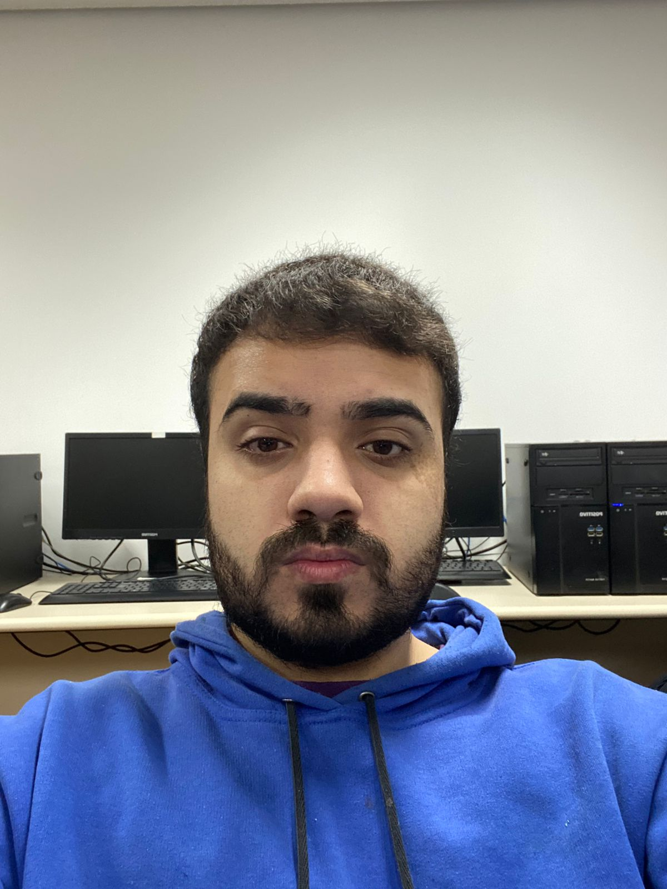
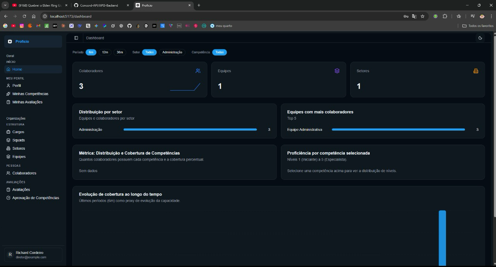

# Sobre mim

  
    
  Victor Nogueira

## Contatos
* [GitHub](https://github.com/victorgsnogueira)
* [LinkedIn](https://www.linkedin.com/in/victorgsnogueira/)

## Perfil Profissional

Meu primeiro contato com o mundo da programação ocorreu em 2022, durante uma oportunidade como Jovem Aprendiz na **Embraer**, onde pude dar meus primeiros passos na área de tecnologia e decidir seguir essa carreira.

Atualmente, atuo como Estagiário de Desenvolvimento na **DM**, uma grande empresa do ramo de crédito. No meu dia a dia, trabalho principalmente com a stack de **Python e SQL**, ajudando a desenvolver soluções e manipular dados fundamentais para as regras de negócio da companhia.

---

## Tecnologias e Ferramentas

Ao longo da minha jornada profissional e acadêmica, venho me capacitando em diversas tecnologias para o desenvolvimento full stack e banco de dados:

---

## Portfólio de Projetos

### Proficio | *Projeto Integrador (2025/2)*

**Empresa Parceira:** ALTAVE

#### O Desafio
A ALTAVE enfrentava uma dificuldade latente na gestão e no mapeamento das competências de seus colaboradores. A falta de uma base de dados centralizada e acessível sobre as *hard skills*, *soft skills*, experiências profissionais e níveis de proficiência impedia a alocação assertiva de pessoas em novas demandas, projetos ou *squads*. Sem uma ferramenta dedicada, as lideranças precisavam contar com processos manuais e morosos para encontrar os talentos certos internamente.

#### A Solução Proposta
Para resolver esse problema, nossa equipe de desenvolvimento construiu o **Proficio**, uma plataforma inteligente pensada para atuar como um "LinkedIn corporativo interno". O sistema unifica as informações profissionais e centraliza o mapeamento de competências da empresa.

Com perfis interativos, os colaboradores conseguem gerenciar suas habilidades e atualizar suas proficiências. Simultaneamente, gestores e diretores possuem acesso a dashboards analíticos e relatórios consolidados. A plataforma é equipada com gestão de permissões de acesso (Diretor, Gestor e Colaborador), módulos de avaliação e um avançado sistema de buscas e filtros, otimizando completamente a gestão de talentos.

#### Minhas Contribuições Técnicas
Durante o desenvolvimento do Proficio, assumi responsabilidades-chave no ecossistema da aplicação:

*   **Desenvolvimento Frontend (End-to-End):** Fui responsável pelo desenvolvimento de toda a aplicação frontend. Cuidei da arquitetura do cliente, criação dos componentes visuais, integração contínua com a API e de garantir uma interface de usuário agradável e funcional.
*   **Implementações no Backend:** Apesar de meu foco principal ter sido a interface, atuei diretamente no backend na criação de novas funcionalidades, sendo o grande destaque o desenvolvimento do sistema de **Login (autenticação e autorização)** e a estruturação de rotas adicionais vitais para o funcionamento da aplicação.
*   **Code Review (Frontend e Backend):** Exerci um papel fundamental de liderança técnica garantindo a qualidade do código entregue pelo time. Realizei as revisões de código de maneira consistente, cobrindo tanto o lado do servidor quanto o da interface, garantindo as melhores práticas e prevenindo bugs.

---

## Competências

### Hard Skills
*   **Python:** Conhecimento Intermediário
*   **SQL (PostgreSQL / Relacionais):** Conhecimento Intermediário
*   **TypeScript:** Conhecimento Intermediário
*   **React:** Conhecimento Intermediário
*   **Docker:** Conhecimento Intermediário
*   **JavaScript, HTML & CSS:** Conhecimento Intermediário
*   **Git / GitHub:** Conhecimento Intermediário

### Soft Skills
*   **Ótima Comunicação:** Tenho grande facilidade para me expressar, garantindo alinhamentos claros na equipe. Consigo traduzir necessidades técnicas de forma didática e manter a comunicação transparente durante os ciclos de desenvolvimento.
*   **Excelente Colaboração:** Trabalho extremamente bem em equipe. Acredito que o conhecimento deve ser compartilhado e, através do code review constante e pareamentos na resolução de impedimentos, sempre busco impulsionar o time para alcançar os melhores resultados.
