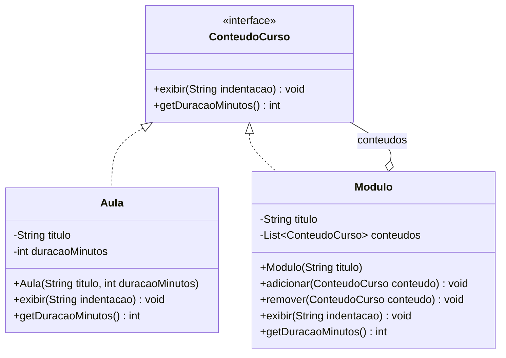

# Composite Pattern

## Estrutura

## Diagrama UML (Mermaid)



## Diagrama UML (ASCII)

```
+------------------------------+
|        <<interface>>         |
|       ConteudoCurso          |
|------------------------------|
| + exibir(indentacao): void   |
| + getDuracaoMinutos(): int   |
+------------------------------+
              ^
              | implements
       _______|________
       |              |
       v              v
+-------------+  +------------------------+
|    Aula     |  |        Modulo          |
| (Leaf)      |  |      (Composite)       |
|-------------|  |------------------------|
| - titulo    |  | - titulo               |
| - duracao   |  | - conteudos: List      |
|-------------|  |------------------------|
| + exibir()  |  | + adicionar(Conteudo)  |
| + getDur... |  | + remover(Conteudo)    |
+-------------+  | + exibir()             |
                 | + getDuracaoMinutos()  |
                 +------------------------+
```

## Hierarquia de exemplo

```
[Curso Java]
  [Fundamentos]
    - Variaveis: 20 min
    - Condicionais: 30 min
  [Orientacao a Objetos]
    [Classes e Objetos]
      - Classes: 35 min
      - Objetos: 25 min
```

## Por que e um PATTERN?

- Cliente usa a mesma interface para aulas e modulos.
- Permite hierarquias arbitrarias sem if/else no cliente.
- A duracao total e calculada recursivamente.
