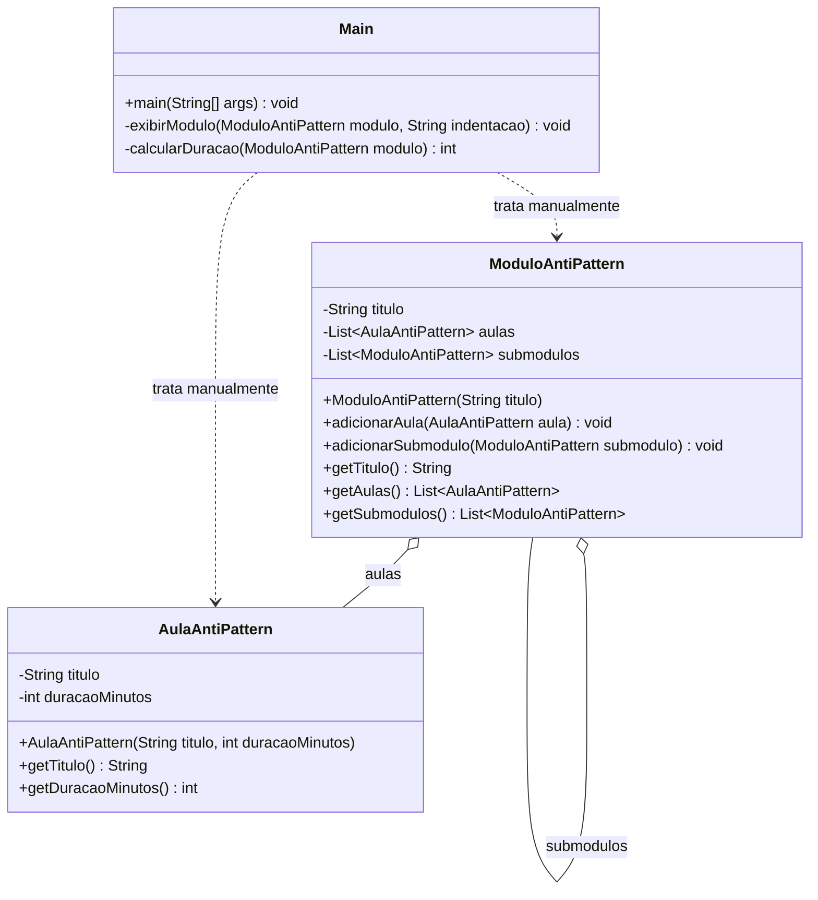

# Composite AntiPattern

## Estrutura

## Diagrama UML (Mermaid)



## Diagrama UML (ASCII)

```
+------------------------------+    +------------------------------+
|       ModuloAntiPattern      |    |        AulaAntiPattern       |
|------------------------------|    |------------------------------|
| - titulo: String             |    | - titulo: String             |
| - aulas: List<Aula>          |    | - duracaoMinutos: int        |
| - submodulos: List<Modulo>   |    |------------------------------|
|------------------------------|    | + getTitulo(): String        |
| + adicionarAula(Aula)        |    | + getDuracaoMinutos(): int   |
| + adicionarSubmodulo(Modulo) |    +------------------------------+
| + getAulas(): List<Aula>     |
| + getSubmodulos(): List      |
+------------------------------+
```

## Problema

Nao existe uma interface comum entre `ModuloAntiPattern` e `AulaAntiPattern`.
O cliente precisa tratar aulas e submodulos manualmente.

## Como corrigir?

Criar a interface `ConteudoCurso` com `exibir()` e `getDuracaoMinutos()`.
Aulas e modulos passam a ser usados de forma uniforme.
