# MVP - Plataforma de Cursos com 3 Padroes de Projeto

Este MVP simula uma plataforma de cursos online usando os tres padroes do
repositorio:

- **Composite**: `Aula` e `Modulo` implementam `ConteudoCurso`, permitindo
  montar trilhas com aulas simples e modulos aninhados.
- **Strategy**: `Matricula` usa `AvaliacaoStrategy` para alternar o criterio de
  aprovacao entre nota, presenca e projeto.
- **Observer**: `Matricula` notifica `NotificacaoAluno`, `PainelProfessor` e
  `AppMentoria` sempre que o status muda.

## Diagrama UML (Mermaid)

```mermaid
classDiagram
    class ConteudoCurso {
        <<interface>>
        +exibir(String indentacao) void
        +getDuracaoMinutos() int
    }

    class Aula {
        -String titulo
        -int duracaoMinutos
        +exibir(String indentacao) void
        +getDuracaoMinutos() int
    }

    class Modulo {
        -String titulo
        -List~ConteudoCurso~ conteudos
        +adicionar(ConteudoCurso conteudo) void
        +exibir(String indentacao) void
        +getDuracaoMinutos() int
    }

    class AvaliacaoStrategy {
        <<interface>>
        +aprovado(double nota, double presenca) boolean
        +getDescricao() String
    }

    class AvaliacaoPorNota {
        -double notaMinima
        +aprovado(double nota, double presenca) boolean
        +getDescricao() String
    }

    class AvaliacaoPorPresenca {
        -double presencaMinima
        +aprovado(double nota, double presenca) boolean
        +getDescricao() String
    }

    class AvaliacaoPorProjeto {
        -double notaMinima
        -double presencaMinima
        +aprovado(double nota, double presenca) boolean
        +getDescricao() String
    }

    class MatriculaObserver {
        <<interface>>
        +atualizar(String aluno, String curso, String status) void
    }

    class NotificacaoAluno {
        -String email
        +atualizar(String aluno, String curso, String status) void
    }

    class PainelProfessor {
        -String professor
        +atualizar(String aluno, String curso, String status) void
    }

    class AppMentoria {
        -String mentor
        +atualizar(String aluno, String curso, String status) void
    }

    class Matricula {
        -String aluno
        -String curso
        -ConteudoCurso trilha
        -List~MatriculaObserver~ observers
        -AvaliacaoStrategy avaliacaoStrategy
        -String status
        +setAvaliacaoStrategy(AvaliacaoStrategy avaliacaoStrategy) void
        +adicionarObserver(MatriculaObserver observer) void
        +exibirTrilha() void
        +avaliar(double nota, double presenca) void
        +atualizarStatus(String novoStatus) void
        -notificarTodos() void
    }

    ConteudoCurso <|.. Aula
    ConteudoCurso <|.. Modulo
    Modulo o-- ConteudoCurso : conteudos

    AvaliacaoStrategy <|.. AvaliacaoPorNota
    AvaliacaoStrategy <|.. AvaliacaoPorPresenca
    AvaliacaoStrategy <|.. AvaliacaoPorProjeto

    MatriculaObserver <|.. NotificacaoAluno
    MatriculaObserver <|.. PainelProfessor
    MatriculaObserver <|.. AppMentoria

    Matricula o-- ConteudoCurso : trilha
    Matricula o-- AvaliacaoStrategy : criterio
    Matricula o-- MatriculaObserver : observers
```



## Como executar

Na pasta `MVP`:

```bash
javac -d out src/mvp/*.java
java -cp out mvp.Main
```

## Fluxo demonstrado

1. A trilha do curso e montada com aulas e modulos.
2. A matricula calcula a carga horaria usando a arvore do Composite.
3. O criterio de aprovacao e escolhido via Strategy.
4. Cada mudanca de status dispara notificacoes via Observer.
