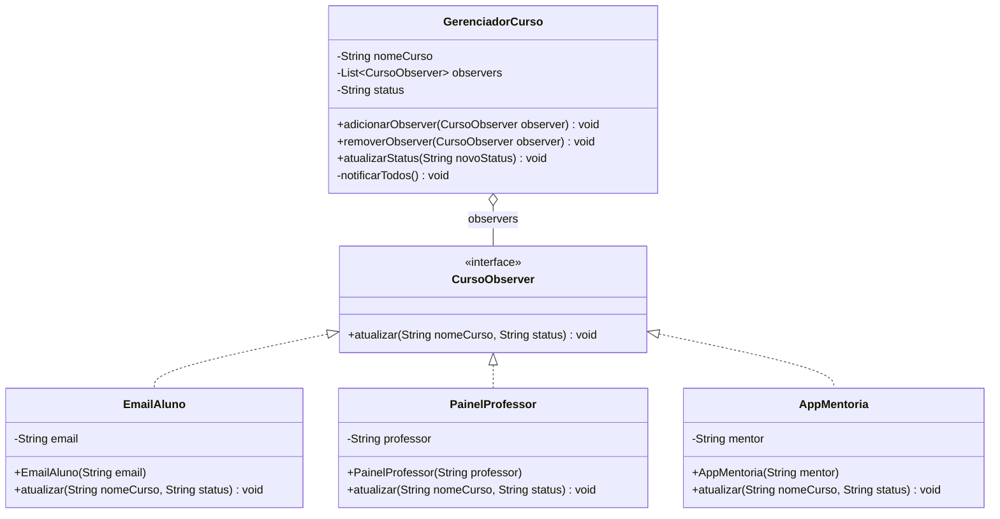

# Observer Pattern

## Estrutura

## Diagrama UML (Mermaid)



## Diagrama UML (ASCII)

```
+-------------------------------+
|        <<interface>>          |
|       CursoObserver           |
|-------------------------------|
| + atualizar(curso, status)    |
+-------------------------------+
              ^
              | implements
    __________|_____________
    |          |            |
    v          v            v
+----------+ +----------+ +-------------+
|EmailAluno| |Painel    | |AppMentoria  |
|          | |Professor | |             |
+----------+ +----------+ +-------------+

+--------------------------------+
|        GerenciadorCurso        | <Subject>
|--------------------------------|
| - nomeCurso: String            |
| - status: String               |
| - observers: List<Observer>    |
|--------------------------------|
| + adicionarObserver(Observer)  |
| + removerObserver(Observer)    |
| + atualizarStatus(String)      |
| - notificarTodos()             |
+--------------------------------+
```

## Relacoes

| Elemento         | Papel                |
|------------------|----------------------|
| CursoObserver    | Observer interface   |
| EmailAluno       | ConcreteObserver A   |
| PainelProfessor  | ConcreteObserver B   |
| AppMentoria      | ConcreteObserver C   |
| GerenciadorCurso | Subject / Publisher  |

## Por que e um PATTERN?

- O subject nao conhece os tipos concretos de notificacao.
- Novos canais podem se registrar sem alterar `GerenciadorCurso`.
- Observers podem ser adicionados e removidos em runtime.
- Reduz acoplamento entre evento e reacao.
