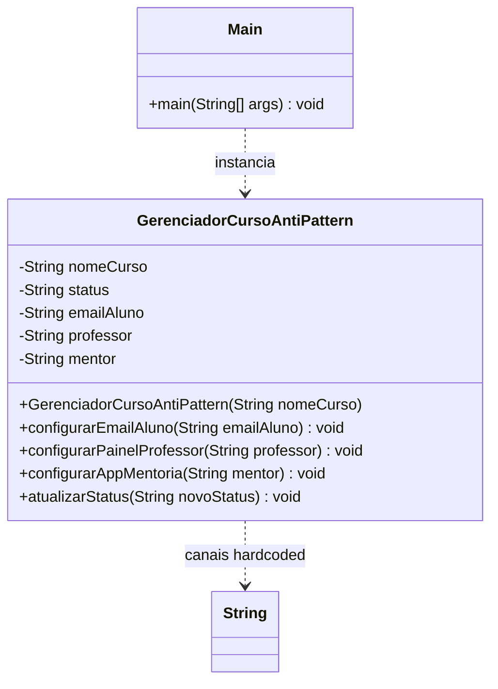

# Observer AntiPattern

## Estrutura

## Diagrama UML (Mermaid)



## Diagrama UML (ASCII)

```
+------------------------------------------------+
|          GerenciadorCursoAntiPattern           |
|------------------------------------------------|
| - nomeCurso: String                            |
| - status: String                               |
| - emailAluno: String        <- hardcoded       |
| - professor: String         <- hardcoded       |
| - mentor: String            <- hardcoded       |
|------------------------------------------------|
| + configurarEmailAluno(...)                    |
| + configurarPainelProfessor(...)               |
| + configurarAppMentoria(...)                   |
| + atualizarStatus(String)                      |
|   if emailAluno != null -> envia email         |
|   if professor != null  -> atualiza painel     |
|   if mentor != null     -> notifica app        |
+------------------------------------------------+
```

## Problemas

| Problema              | Descricao                                             |
|-----------------------|-------------------------------------------------------|
| Alto acoplamento      | Subject conhece todos os canais concretos            |
| Viola OCP             | Novo canal exige alterar `atualizarStatus()`          |
| Pouco extensivel      | Nao ha registro/remocao generica de assinantes        |
| Responsabilidade unica| Gerencia curso e tambem envia notificacoes            |

## Como corrigir?

Criar a interface `CursoObserver` e fazer o subject manter uma lista de
observers, sem conhecer implementacoes concretas.
