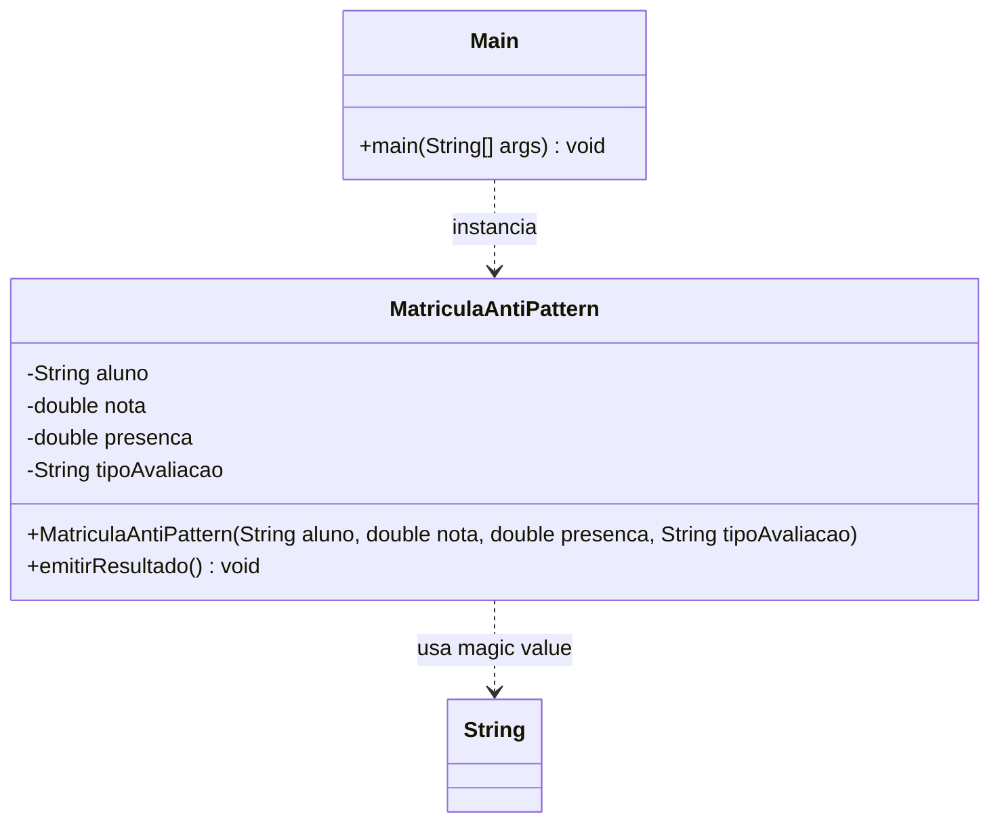

# Strategy AntiPattern

## Estrutura

## Diagrama UML (Mermaid)



## Diagrama UML (ASCII)

```
+------------------------------------------------+
|             MatriculaAntiPattern               |
|------------------------------------------------|
| - aluno: String                                |
| - nota: double                                 |
| - presenca: double                             |
| - tipoAvaliacao: String  <- magic value        |
|------------------------------------------------|
| + emitirResultado()                            |
|   if tipo == "nota"      -> compara nota       |
|   if tipo == "presenca"  -> compara presenca   |
|   if tipo == "projeto"   -> compara ambos      |
+------------------------------------------------+
```

## Problemas

| Problema          | Descricao                                             |
|-------------------|-------------------------------------------------------|
| Viola OCP         | Novo criterio exige editar `emitirResultado()`        |
| Magic strings     | Erros de digitacao aparecem apenas em runtime         |
| Alto acoplamento  | A matricula conhece todos os criterios concretos      |
| Dificil de testar | Nao da para testar criterios isoladamente             |

## Como corrigir?

Aplicar o Strategy Pattern: extrair cada criterio para uma classe que
implementa `AvaliacaoStrategy`.
