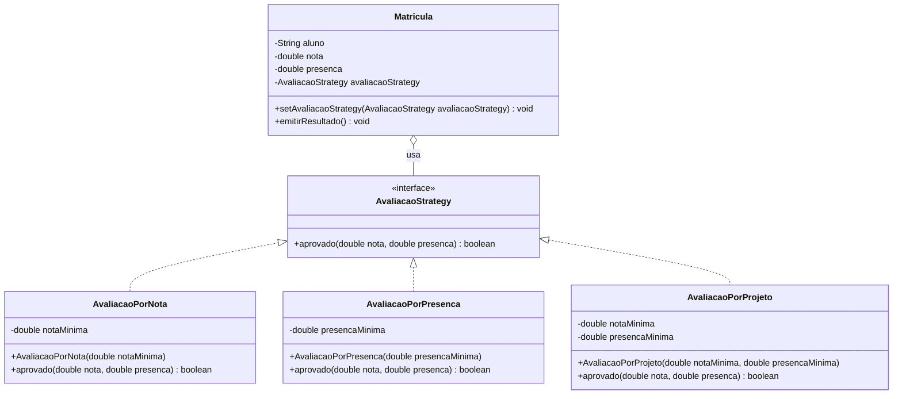

# Strategy Pattern

## Estrutura

## Diagrama UML (Mermaid)



## Diagrama UML (ASCII)

```
+--------------------------------+
|        <<interface>>           |
|       AvaliacaoStrategy        |
|--------------------------------|
| + aprovado(nota, presenca):    |
|   boolean                      |
+--------------------------------+
              ^
              | implements
    __________|_____________
    |          |            |
    v          v            v
+-----------+ +-----------+ +------------+
|Avaliacao  | |Avaliacao  | |Avaliacao   |
|PorNota    | |PorPresenca| |PorProjeto  |
|-----------| |-----------| |------------|
|+aprovado()| |+aprovado()| |+aprovado() |
+-----------+ +-----------+ +------------+

+-------------------------------+
|           Matricula           | <Context>
|-------------------------------|
| - aluno: String               |
| - nota: double                |
| - presenca: double            |
| - estrategia:                 |
|   AvaliacaoStrategy           |
|-------------------------------|
| + setAvaliacaoStrategy(...)   |
| + emitirResultado()           |
+-------------------------------+
```

## Relacoes

| Elemento            | Papel               |
|---------------------|---------------------|
| AvaliacaoStrategy   | Strategy interface  |
| AvaliacaoPorNota    | ConcreteStrategy A  |
| AvaliacaoPorPresenca| ConcreteStrategy B  |
| AvaliacaoPorProjeto | ConcreteStrategy C  |
| Matricula           | Context             |

## Por que e um PATTERN?

- A `Matricula` nao conhece o criterio concreto de avaliacao.
- Novos criterios podem ser adicionados sem alterar `Matricula`.
- Segue OCP e DIP.
- O criterio pode ser trocado em tempo de execucao.
